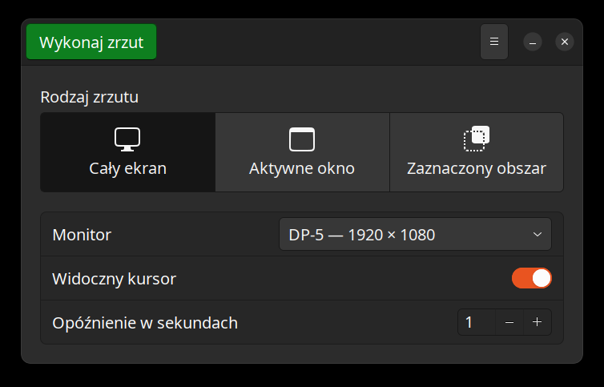

# Better Screenshot

A fork of [GNOME Screenshot](https://gitlab.gnome.org/GNOME/gnome-screenshot) for
multi-monitor desktops.

On a multi-monitor setup the stock tool gives you one image spanning every
screen, and cropping it afterwards gets old quickly. Better Screenshot adds a
monitor drop-down, remembers which monitor you picked, and writes the file
straight to your pictures folder. A routine screenshot costs one click.



## What it adds

- **Per-monitor capture.** Pick a physical screen from the dialog; the whole
  desktop stays available as the last entry in the list.
- **It remembers.** The choice is stored by connector name (`DP-5`), not by
  index, so it survives replugging and docking. If that monitor is gone, it
  falls back to the primary one rather than to the whole desktop.
- **No save dialog.** Captures land in your pictures directory and the program
  exits.
- **Menus survive the countdown.** The delay holds no keyboard or pointer grab,
  so you can open a menu and have it appear in the picture.
- **Scriptable.** `--monitor` takes a number or a connector name, which makes it
  usable from a key binding.

It installs **alongside** `gnome-screenshot` — different binary, application ID
and settings — so the original stays where it is.

## Install

Download the `.deb` from [Releases](https://github.com/k-nowicki/better-screenshot/releases):

```sh
sudo apt install ./better-screenshot_1.0.0_amd64.deb
```

## Usage

```sh
better-screenshot --interactive      # the dialog
better-screenshot --monitor DP-5     # one monitor, by connector name
better-screenshot --monitor 1        # the same monitor, by number
better-screenshot                    # the whole desktop
```

`better-screenshot --help` lists the rest. With no `--monitor`, a
non-interactive run captures the whole desktop, exactly like `gnome-screenshot`,
so existing key bindings keep their behaviour.

The remembered monitor lives in `~/.config/better-screenshot/monitor.ini`.

## X11 and Wayland

Capture works on both, but not identically, and the reason is worth stating.
GNOME Shell only accepts `org.gnome.Shell.Screenshot` calls from four
well-known names, which any independently named application is not among. Under
Wayland this program therefore goes through
`org.freedesktop.portal.Screenshot`, the interface intended for applications
that are not the compositor's own tools.

| | X11 | Wayland (portal) |
|---|---|---|
| Whole desktop | yes | yes |
| Single monitor | yes | yes |
| Single window | yes | no |
| Include the pointer | yes | no |
| Permission prompt | no | on first use |

Controls that cannot work are disabled in the dialog rather than left live and
ignored. `BETTER_SCREENSHOT_BACKEND=x11|portal|shell` forces a backend, which is
useful when reporting a bug.

## Building from source

```sh
sudo apt install meson ninja-build pkg-config gettext desktop-file-utils \
                 libgtk-3-dev libhandy-1-dev libglib2.0-dev libx11-dev libxext-dev
meson setup _build
ninja -C _build
sudo ninja -C _build install
```

To run it from the build tree without installing, point GLib at the schema
compiled there. The settings schema is not optional: GLib aborts at startup if
it cannot find one, so an uninstalled run needs this.

```sh
GSETTINGS_SCHEMA_DIR=_build/data ./_build/src/better-screenshot --interactive
```

## Relationship to GNOME Screenshot

Forked from GNOME Screenshot 41.0 (upstream commit `c04ddd5`), which upstream
has marked unmaintained. All original copyright notices are intact and the
changes are described in `NEWS` and in the commit history. This project is not
affiliated with or endorsed by the GNOME Project.

Licensed under the **GNU GPL, version 2 or later** — see `COPYING`.
